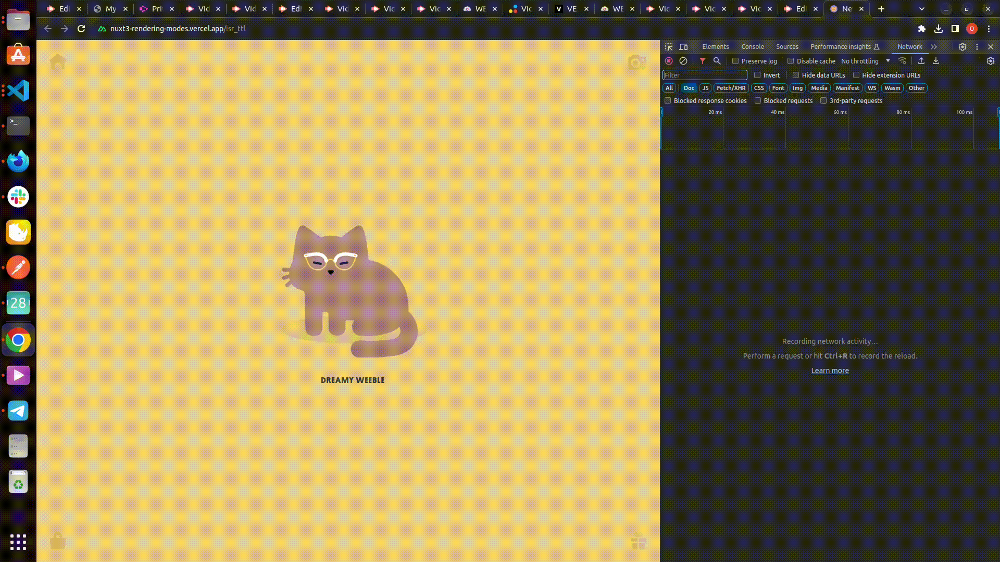

# Nuxt 3 Rendering modes

Look at the [Nuxt 3 documentation](https://nuxt.com/docs/getting-started/introduction) to learn more.

## Startup
### Setup

Make sure to install the dependencies:

```bash
# npm
npm install

# pnpm
pnpm install

# yarn
yarn install

# bun
bun install
```

### Development Server

Start the development server on `http://localhost:3000`:

```bash
# npm
npm run dev

# pnpm
pnpm run dev

# yarn
yarn dev

# bun
bun run dev
```

### Production

Build the application for production:

```bash
# npm
npm run build

# pnpm
pnpm run build

# yarn
yarn build

# bun
bun run build
```

Locally preview production build:

```bash
# npm
npm run preview

# pnpm
pnpm run preview

# yarn
yarn preview

# bun
bun run preview
```

Check out the [deployment documentation](https://nuxt.com/docs/getting-started/deployment) for more information.

## Story behind

We were building the listing site with Nuxt 3 and wanted to make sure we use proper rendering mode for each page to optimize the page load times while preserving the SEO benefits. When we looked into this in more details, we could see that the documentation is somewhat scarce, especially for newer and more complex rendering modes, such as ISR (more details on it coming below), especially in terms of specific technical details of functionality and testing; various rendering modes are used under different names in different knowledge resources and some peculiarities exist regarding the implementation between different providers, such as Vercel, Netlify etc.
This brought us the idea of summarizing the information we found in below article, which provides both conceptual explanation and technical details regarding setting up various rendering modes in Nuxt 3, all in plain English, so that it is easy for understand even for relative beginners.

Knowledge prerequisites: base knowledge of Nuxt

## Rendering modes
### Project setup
Project has 7 pages, each containing curent time and html response from the same route (route `/api/hello` returns json response with current time) with different available rendering modes enabled.

[Example of page code:](pages/spa.vue)
```
<template>
    <div>
        <p>{{ pageType }} page</p>
        <pre>{{ new Date().toUTCString() }} </pre>
        <pre>{{ data }}</pre>
        <NuxtLink to="/">Home</NuxtLink>
    </div>
</template>
<script setup lang="ts">
const pageType = "SWR ttl"; // value differs based on route
const { data } = await useFetch('/api/hello')
</script>
```
On this page we are rendering two timestamps:
1. API response which contains the timestamp:
```
<pre>{{ data }}</pre>
```
2. Current timestamp:
```
<pre>{{ new Date().toUTCString() }} </pre>
```
We use these two timestamps to illustrate the functionality in each rendering mode due to hydration process: client-side process during which Vue takes over the static HTML sent by the server and turns it into dynamic DOM that can react to client-side data changes. In our case, this means that current date will always reflect a current timestamp during page render time, while the time from API response will show the timestamp of when the html was rendered on server. 

[API route:](server/api/hello.ts)
```
export default defineEventHandler((event) => {
  return {
    hello: "world" + new Date().toUTCString(),
  };
});
```
Rendering modes are set up in [nuxt.config](nuxt.config.ts):
```
export default defineNuxtConfig({
  devtools: { enabled: true },
  ssr: true,
  routeRules: {
    "/isr_ttl": { isr: 60 },
    "/isr_no_ttl": { isr: true },
    "/swr_ttl": { swr: 60 },
    "/swr_no_ttl": { swr: true },
    "/ssg": { prerender: true },
    "/spa": { ssr: false },
  },
});
```

### Technical details and showcase
#### SPA
**Single Page Application** (also called **Client Side Rendering**).

HTML elements are generated after the browser downloads and parses all the JavaScript code containing the instructions to create the current interface.

We use the route `/spa` to illustrate how this rendering mode works:

| Data                                          | Value                         |
| -------------------------------               | ----------------------------- |
| Time in server rendered html                  | HTML response is blank        |
| Time in api response                          | Fri, 05 Jan 2024 13:26:58 GMT |
| Time after hydration                          | Fri, 05 Jan 2024 13:26:58 GMT |

As we can see in the table, html response is blank, and time after hydration is same as time received in api response. This is because api request happens client-side. On the subsequent requests / page reload, html response will be blank each time and time will change each time as well, but will remain same for browser-rendered value and api response value.


To enable this mode, set up a route rule in nuxt.config as following:
```
  routeRules: {
    "/spa": { ssr: false },
  },
```
<div id="ssr-tech-details"></div>

#### SSR
**Server Side Rendering** (also called **Universal Rendering**).

Nuxt server generates the html on demand and returns a fully rendered HTML page to the browser.

We use the route `/ssr` to illustrate behaviour of this rendering mode:

| Data                                          | Value                         |
| -------------------------------               | ----------------------------- |
| Time in server rendered html                  | Fri, 05 Jan 2024 14:07:54 GMT |
| Time in api response                          | Fri, 05 Jan 2024 14:07:54 GMT |
| Time after hydration                          | Fri, 05 Jan 2024 14:07:55 GMT |

In this case, time after hydration may be slightly different from the time in api response as api response is generated prior, but timestamps are still very close to each other as html generation happens on demand and is not cached. This behavior will not change in subsequent requests / page reload.


To enable this mode, enable ssr in nuxt.config as following:
```
  ssr: true,
```
#### SSG
**Static Site Generation**

Page is generated at build time and served to the browser and is not regenerated again until next build

Route `/ssg` shows SSG behavior:

| Data                                          | Value                         |
| -------------------------------               | ----------------------------- |
| Time in server rendered html                  | Fri, 05 Jan 2024 12:18:57 GMT |
| Time in api response                          | Fri, 05 Jan 2024 12:18:57 GMT |
| Time after hydration                          | Fri, 05 Jan 2024 14:23:23 GMT |

In above table we can see quite big time difference between time after hydration vs other timestamps since SSG mode generates html during build time and it does not change later. This behavior will not change in subsequent requests / page reload.


To enable this mode, set up a route rule in nuxt.config as following:
```
  routeRules: {
    "/ssg": { prerender: true },
  },
```
#### SWR
**Stale While Revalidate**

This mode utilizes a technique called stale-while-revalidate, which allows the server to serve stale data while revalidating the data in the background. Server on demand generates and returns html response. This html response is cached on server (when app is deployed, this may differ based on provider (Vercel, Netlify etc.): information re- where the cache is stored is typically not disclosed by provider). There are two possible settings for caching:
- no TTL (time to live) means response is cached until it changes;
- TTL set means response is cached until TTL expired.
When detected change during receiving request (no TTL) or when TTL expired, server returns stale response and in the backround generates new html, which is then served on next request.

##### SWR without TTL
To see the behavior of SWR mode without TTL we have an `/swr_no_ttl` route:

| Data                                          | Value - first request         | Value - second request        | Value - third request         |
| -------------------------------               | ----------------------------- | ----------------------------- | ----------------------------- |
| Time in server rendered html                  | Fri, 05 Jan 2024 15:21:03 GMT | Fri, 05 Jan 2024 15:21:03 GMT | Fri, 05 Jan 2024 15:21:09 GMT |
| Time in api response                          | Fri, 05 Jan 2024 15:21:03 GMT | Fri, 05 Jan 2024 15:21:03 GMT | Fri, 05 Jan 2024 15:21:09 GMT |
| Time after hydration                          | Fri, 05 Jan 2024 15:21:04 GMT | Fri, 05 Jan 2024 15:21:10 GMT | Fri, 05 Jan 2024 15:21:15 GMT |

Let's dissect the above table a bit.
In the first column we see similar behavior to the one seen with [SSR](#ssr-tech-details), as the time after hydration is slightly different from the time sent by the API response. Then in the second column we can see that the user waited about 7 seconds before reloading the page. The content gets served from cache as only the time after hydration changes. This however, triggers the regeneration of the page in the background, as the API response changed since the first page load. As a result we get a new version of the page on the third time we request it. Compare the "Time after hydration" in the second column with "Time in server rendered HTML" in the third column. There is only a 1 second difference between the too, the server rendering of the third request happened simultaneously with the second request being served.


To enable this mode, set up a route rule in nuxt.config as following:
```
  routeRules: {
    "/swr_no_ttl": { swr: true },
  },
```
##### SWR with TTL
This rendering mode is set up on `/swr_ttl` route:

| Data                                          | Value - first request         | Value - second request        | Value - first request after TTL of 60 seconds passed | Value - second request after TTL of 60 seconds passed |
| -------------------------------               | ----------------------------- | ----------------------------- | ---------------------------------------------------- | ---------------------------------------------------- |
| Time in server rendered html                  | Fri, 05 Jan 2024 15:30:16 GMT | Fri, 05 Jan 2024 15:30:16 GMT | Fri, 05 Jan 2024 15:30:16 GMT                        | Fri, 05 Jan 2024 15:31:21 GMT                        |
| Time in api response                          | Fri, 05 Jan 2024 15:30:16 GMT | Fri, 05 Jan 2024 15:30:16 GMT | Fri, 05 Jan 2024 15:30:16 GMT                        | Fri, 05 Jan 2024 15:31:21 GMT                        |
| Time after hydration                          | Fri, 05 Jan 2024 15:30:17 GMT | Fri, 05 Jan 2024 15:30:28 GMT | Fri, 05 Jan 2024 15:31:22 GMT                        | Fri, 05 Jan 2024 15:31:29 GMT                        |

Here, again, we can see that first request's values are similar to the ones in [SSR mode](#ssr-tech-details): only time after hydration is slightly different compared to other values. Second and subsequent requests until TTL of 60 seconds passes contain same timestamp for "Time in api response" row as the first request. After TTL expires (third column), time in api response is still stale, and in fourth column we can see new timestamp in "Time in api response" row.


To enable this mode, set up a route rule in nuxt.config as following:
```
  routeRules: {
    "/swr_ttl": { swr: 60 },
  },
```
#### ISR
**Incremental Static Regeneration** (also called **Hybrid Mode**)

This rendering mode works pretty much same way as SWR, with the only difference that response is cached on CDN network. There are two possible settings for caching:
- no TTL (time to live) means response is cached permanently;
- TTL set means response is cached until TTL expired.

***Note***: ISR in Nuxt 3 is different from ISR in Next.js in terms of that in Nuxt 3 with ISR html is generated on demand, while in Next.js it is generated during build time by default.

##### ISR without TTL
This mode is available on `/isr_no_ttl` route:

| Data                                          | Value - first request         | Value - second request        | Value - third request         |
| -------------------------------               | ----------------------------- | ----------------------------- | ----------------------------- |
| Time in server rendered html                  | Fri, 05 Jan 2024 14:39:23 GMT | Fri, 05 Jan 2024 14:39:23 GMT | Fri, 05 Jan 2024 14:39:23 GMT |
| Time in api response                          | Fri, 05 Jan 2024 14:39:23 GMT | Fri, 05 Jan 2024 14:39:23 GMT | Fri, 05 Jan 2024 14:39:23 GMT |
| Time after hydration                          | Fri, 05 Jan 2024 14:39:24 GMT | Fri, 05 Jan 2024 14:39:30 GMT | Fri, 05 Jan 2024 14:39:36 GMT |

In above table and screencast we can see that value in "Time in api response" row does not change, even after 60 seconds have passed (typically Vercel's default TTL) since ISR without TTL caches permanently.


To enable this mode, set up a route rule in nuxt.config as following:
```
  routeRules: {
    "/isr_no_ttl": { isr: true },
  },
```
##### ISR with TTL
Route `/isr_ttl` shows ISR behaviour without TTL: 

| Data                                          | Value - first request         | Value - second request        | Value - first request after TTL of 60 seconds passed | Value - second request after TTL of 60 seconds passed |
| -------------------------------               | ----------------------------- | ----------------------------- | ---------------------------------------------------- | ---------------------------------------------------- |
| Time in server rendered html                  | Tue, 09 Jan 2024 14:32:19 GMT | Tue, 09 Jan 2024 14:32:19 GMT | Tue, 09 Jan 2024 14:32:19 GMT                        | Tue, 09 Jan 2024 14:33:19 GMT                        |
| Time in api response                          | Tue, 09 Jan 2024 14:32:19 GMT | Tue, 09 Jan 2024 14:32:19 GMT | Tue, 09 Jan 2024 14:32:19 GMT                        | Tue, 09 Jan 2024 14:33:19 GMT                        |
| Time after hydration                          | Tue, 09 Jan 2024 14:32:20 GMT | Tue, 09 Jan 2024 14:32:27 GMT | Tue, 09 Jan 2024 14:33:20 GMT                        | Tue, 09 Jan 2024 14:33:27 GMT                        |

Upon first request we get values similar to [SSR behavior](#ssr-tech-details) where only time after hydration is slightly different. Second and subsequent requests until TTL of 60 seconds passes contain same timestamp for "Time in api response" row as the first request. After TTL expires (third column), time in api response is still stale, and in fourth column we can see new timestamp in "Time in api response" row..



To enable this mode, set up a route rule in nuxt.config as following:
```
  routeRules: {
    "/isr_ttl": { isr: 60 },
  },
```
Note that all above mentioned rendering modes expect ISR can easily be tested in local environment as well by building and previewing the app. Since ISR utilizes CDN network, it would require CDN in order to test (e.g. by deploying to Vercel).
