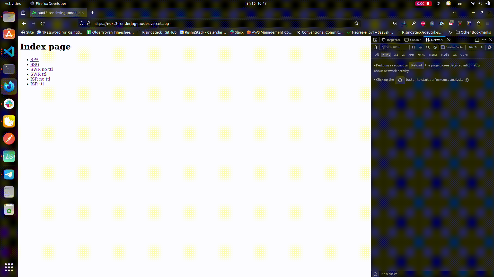
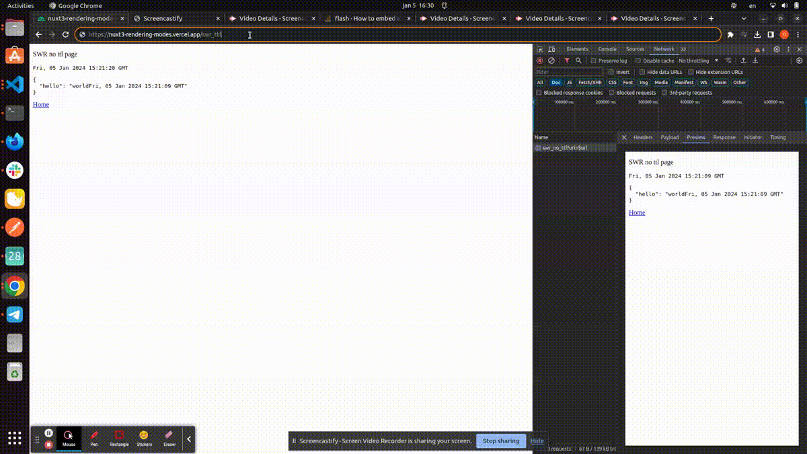

# Nuxt 3 Rendering modes

Look at the [Nuxt 3 documentation](https://nuxt.com/docs/getting-started/introduction) to learn more.

## Startup
### Setup

Make sure to install the dependencies:

```bash
# npm
npm install

# pnpm
pnpm install

# yarn
yarn install

# bun
bun install
```

### Development Server

Start the development server on `http://localhost:3000`:

```bash
# npm
npm run dev

# pnpm
pnpm run dev

# yarn
yarn dev

# bun
bun run dev
```

### Production

Build the application for production:

```bash
# npm
npm run build

# pnpm
pnpm run build

# yarn
yarn build

# bun
bun run build
```

Locally preview production build:

```bash
# npm
npm run preview

# pnpm
pnpm run preview

# yarn
yarn preview

# bun
bun run preview
```

Check out the [deployment documentation](https://nuxt.com/docs/getting-started/deployment) for more information.

## Rendering modes

### Overview
#### SPA
**Single Page Application** (also called **Client Side Rendering**). [Documentation link](https://nuxt.com/docs/guide/concepts/rendering#client-side-rendering)

In this rendering mode  HTML elements are generated after the browser downloads and parses all the JavaScript code containing the instructions to create the current interface.
#### SSR
**Server Side Rendering** (also called **Universal Rendering**). [Documentation link](https://nuxt.com/docs/guide/concepts/rendering#universal-rendering)

In this mode, Nuxt server generates the html on demand and returns a fully rendered HTML page to the browser.
#### SSG
**Static Site Generation** [Documentation link](https://nuxt.com/docs/getting-started/deployment#selective-pre-rendering)

With this mode, page is generated at build time and served to the browser and is not regenerated again until next build
#### SWR
**Stale While Revalidate** [Documentation link](https://nuxt.com/docs/guide/concepts/rendering#hybrid-rendering)

This mode utilizes a technique called stale-while-revalidate, which allows the server to serve stale data while revalidating the data in the background. Server on demand generates and returns html response, which is cached until it changes (no TTL/time to live) or until TTL expired (with TTL). When detected change during receiving request (no TTL) or when TTL expired, server returns stale response and in the backround generates new html, which is then served on next request.
#### ISR
**Incremental Static Regeneration** (also called **Hybrid Mode**) [Documentation link](https://nuxt.com/docs/guide/concepts/rendering#hybrid-rendering)

This rendering mode works pretty much same way as SWR, with the only difference that response is cached on CDN network. It can be cached permanently or for specified TTL.

### Technical details and showcase
Project has 7 pages, each containing curent time and html response from the same route (route `/api/hello` returns json response with current time) with different available rendering modes enabled:

1. `/spa` - **single page application** (also called **client side rendering**). Below screencast shows that html response returned is blank and time rendered in browser is same as time coming from api response.


To enable this mode, set up a route rule in nuxt.config as following:
```
  routeRules: {
    "/spa": { ssr: false },
  },
```
2. `/ssr` - **server side rendering** (also called **universal rendering**). Below screencast shows that html response for the page is not the same as rendered page: time rendered in browser is slightly different from the time coming from api response as api response is generated prior.



To enable this mode, enable ssr in nuxt.config as following:
```
  ssr: true,
```
3. `/ssg` - **static site generation**. In below screencast we can see that html response served never changes, the only thing which changes is the time rendered in browser.


To enable this mode, set up a route rule in nuxt.config as following:
```
  routeRules: {
    "/ssg": { prerender: true },
  },
```
4. `/swr_no_ttl` - **stale while revalidate** without TTL enabled. Below screencast visualizes this rendering mode: on second request stale response is provided, while on third one updated response is served (since api response includes current time, api response itself is different on each request).


To enable this mode, set up a route rule in nuxt.config as following:
```
  routeRules: {
    "/swr_no_ttl": { swr: true },
  },
```
5. `/swr_ttl` - **stale while revalidate** with TTL 60 seconds enabled. This rendering mode is visible in below screencast where stale response is served for 60 seconds, after it is passed, next request is still containing stale data, after that new data is served.



To enable this mode, set up a route rule in nuxt.config as following:
```
  routeRules: {
    "/swr_ttl": { swr: 60 },
  },
```
6. `/isr_no_ttl` - **incremental static regeneration** (also called **hybrid mode**) without TTL enabled. Below screencast shows that response does not change even after 60 seconds have passed (typically Vercel's default TTL).

To enable this mode, set up a route rule in nuxt.config as following:
```
  routeRules: {
    "/isr_no_ttl": { isr: true },
  },
```
7. `/isr_ttl` - **incremental static regeneration** (also called **hybrid mode**) with TTL of 60 seconds enabled. Below screencast demonstrates that stale response is served for 60 seconds, after it is passed, next request is still containing stale data, after that new data is served.

To enable this mode, set up a route rule in nuxt.config as following:
```
  routeRules: {
    "/isr_ttl": { isr: 60 },
  },
```
Note that all above mentioned rendering modes expect ISR can easily be tested in local environment as well by building and previewing the app. Since ISR utilizes CDN network, it would require CDN in order to test (e.g. by deploying to Vercel).

Vercel deployment can be configured to use [edge functions](https://vercel.com/docs/frameworks/nuxt#edge-functions) or [serverless functions](https://vercel.com/docs/frameworks/nuxt#serverless-functions). Note that SWR works only with edge functions while ISR works only with serverless functions

[//TODO]: # (update SWR/ISR vercel based on response to customer service ticket)