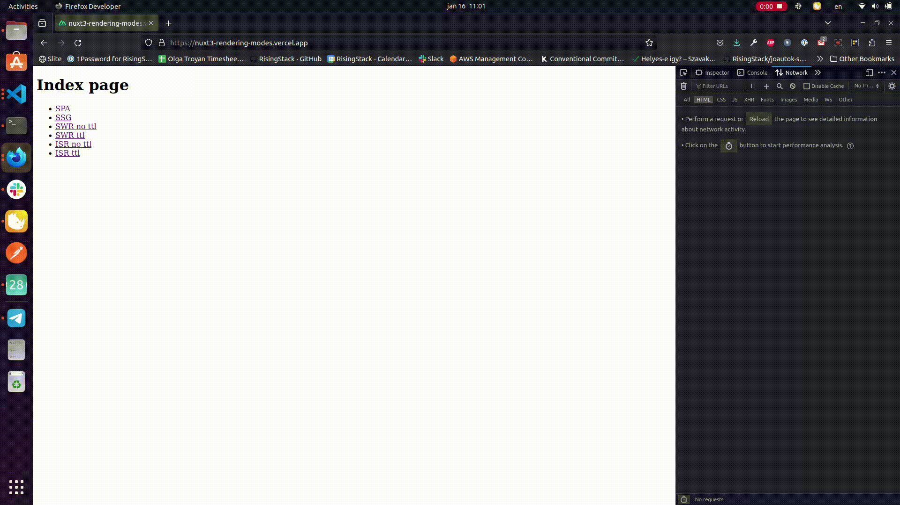

# Nuxt 3 Rendering modes

## Story behind

We were developing a listing site using Nuxt 3 and aimed to optimize page load times while maintaining SEO benefits by choosing the right rendering mode for each page. Upon investigating this, we found that documentation was limited, particularly for newer and more complex rendering modes like [ISR](#isr). This scarcity was evident in the lack of specific technical details for functionality and testing. Moreover, various rendering modes are referred to differently across knowledge resources, and there are notable differences in implementation among providers such as Vercel, Netlify, etc. This led us to compile the information into the following article, which offers a clear, conceptual explanation and technical insights on setting up different rendering modes in Nuxt 3. 

Knowledge prerequisites: base knowledge of Nuxt

## Rendering modes
### Project setup

The project consists of 7 pages, each displaying the current time and an HTML response from the same route. Specifically, the route /api/hello returns a JSON response with the current time, and each page features a different available rendering mode enabled.

The pages differ only in their title that refers to the rendering mode used for generating them. [In the case of the simple SPA for example:](pages/spa.vue)

```vue
<template>
    <div>
        <p>{{ pageType }} page</p>
        <pre>Time after hydration: {{ new Date().toUTCString() }} </pre>
        <pre>Time in server rendered HTML: {{ data }}</pre>
        <NuxtLink to="/">Home</NuxtLink>
    </div>
</template>
<script setup lang="ts">
const pageType = "SPA"; // value differs for each route
const { data } = await useFetch('/api/hello')
</script>
```

To make it visible when the page was rendered, we showcase 2 timestamps on the site:

1. One we get from the API response, to see when was the page rendered by the server::

```vue
<template>
[...]
        <pre>Time in server rendered HTML: {{ data }}</pre>
[...]
</template>

<script setup lang="ts">
const { data } = await useFetch('/api/hello')
</script>
```

2. And one in the browser:

```vue
<pre>Time after hydration: {{ new Date().toUTCString() }} </pre>
```

We utilize these two timestamps to demonstrate the functionality of each rendering mode, focusing on the hydration process. In case you're new to SSR frameworks: First, we send the browser a full-fledged HTML version of the initial state of our site. Then it get's hydrated, meaning Vue takes over, builds whatever it needs, runs client-side JavaScript if necessary and attaches itself to the existing DOM elements. From here on, everything works the same as with any other SPA. In our scenario, this implies that the current first `<pre>` element will always display the timestamp of the time the page got rendered by the browser, while the second `<pre>` element showcases the time Vue got the response from the API, thus when the HTML got rendered on the server. 

Our [API route](server/api/hello.ts) is as simple as this:

```javascript
export default defineEventHandler((event) => {
  return new Date().toUTCString();
});
```

Rendering modes are set up in [nuxt.config](nuxt.config.ts):

```javascript
export default defineNuxtConfig({
  devtools: { enabled: true },
  ssr: true,
  routeRules: {
    "/isr_ttl": { isr: 60 },
    "/isr_no_ttl": { isr: true },
    "/swr_ttl": { swr: 60 },
    "/swr_no_ttl": { swr: true },
    "/ssg": { prerender: true },
    "/spa": { ssr: false },
  },
});
```

#### Startup
Start the example project with:
```bash
git clone git@github.com:RisingStack/nuxt3-rendering-modes.git
cd nuxt3-rendering-modes
pnpm install
pnpm dev
```

### Technical details and showcase
#### SPA

**Single Page Application** (also called **Client Side Rendering**).

HTML elements are generated after the browser downloads and parses all the JavaScript code containing the instructions to create the current interface.

We use the route `/spa` to illustrate how this rendering mode works:

| Data                                          | Value                         |
| -------------------------------               | ----------------------------- |
| Time in server rendered HTML                  | HTML response is blank        |
| Time in API response                          | Tue, 16 Jan 2024 09:47:10 GMT |
| Time after hydration                          | Tue, 16 Jan 2024 09:47:10 GMT |

As we can see in the table, the HTML response is blank, and the "Time after hydration" matches the "Time in API response". This occurs because the API request is made client-side. On subsequent requests or page reloads, the HTML response will always be blank, and the time will change with each request. However, the browser-rendered value and the API response value will consistently be the same.


To enable this mode, set up a route rule in nuxt.config as follows:

```javascript
export default defineNuxtConfig({
  routeRules: {
    "/spa": { ssr: false },
  },
});
```

#### SSR
**Server Side Rendering** (also called **Universal Rendering**).

The Nuxt server generates HTML on demand and delivers a fully rendered HTML page to the browser.

We use the route `/ssr` to illustrate the behaviour of this rendering mode:

| Data                                          | Value                         |
| -------------------------------               | ----------------------------- |
| Time in server rendered HTML                  | Tue, 16 Jan 2024 09:47:45 GMT |
| Time in API response                          | Tue, 16 Jan 2024 09:47:45 GMT |
| Time after hydration                          | Tue, 16 Jan 2024 09:47:48 GMT |

In this case, the "Time after hydration" might slightly differ from the "Time in API response" since the API response is generated beforehand. However, the timestamps will be very close to each other because the HTML generation occurs on demand and is not cached. This behavior will remain consistent across subsequent requests or page reloads.


To enable this mode, enable SSR in `nuxt.config` as follows:

```javascript
export default defineNuxtConfig({
  ssr: true
});
```

#### SSG
**Static Site Generation**

The page is generated at build time, served to the browser, and will not be regenerated again until the next build.

The route `/ssg` demonstrates SSG behavior:

| Data                                          | Value                         |
| -------------------------------               | ----------------------------- |
| Time in server rendered HTML                  | Tue, 16 Jan 2024 10:00:41 GMT |
| Time in API response                          | Tue, 16 Jan 2024 10:00:41 GMT |
| Time after hydration                          | Tue, 16 Jan 2024 10:09:09 GMT |

In the table mentioned above, there is a noticeable time difference between the time after hydration and other timestamps. This is because, in SSG mode, HTML is generated during build time and remains unchanged afterward. This behavior will persist across subsequent requests or page reloads.


To enable this mode, set up a route rule in nuxt.config as follows:

```javascript
export default defineNuxtConfig({
  routeRules: {
    "/ssg": { prerender: true },
  },
});
```

#### SWR
**Stale While Revalidate**

This mode employs a technique called stale-while-revalidate, which enables the server to provide stale data while simultaneously revalidating it in the background. The server generates an HTML response on demand, which is then cached. When deployed, the caching specifics can vary depending on the provider (eg. Vercel, Netlify, etc.), and information about where the cache is stored is usually not disclosed. There are two primary settings for caching:

1. No TTL (Time To Live): This means the response is cached until there is a change in the content.
2. TTL Set: This implies that the response is cached until the set TTL expires.

Nuxt saves the API response that was used for generating the first version of the page. Then upon all subsequent requests, only the API gets called, until the response changes. When a change is detected during a request – with no TTL set – or when the TTL expires, the server returns the stale response and generates new HTML in the background, which will be served for the next request.

##### SWR without TTL

To observe the behavior of the SWR mode without a TTL set, you can take a look at the `/swr_no_ttl` route:

| Data                                          | Value - first request         | Value - second request        | Value - third request         |
| -------------------------------               | ----------------------------- | ----------------------------- | ----------------------------- |
| Time in server rendered HTML                  | Tue, 16 Jan 2024 09:48:55 GMT | Tue, 16 Jan 2024 09:48:55 GMT | Tue, 16 Jan 2024 09:49:02 GMT |
| Time in API response                          | Tue, 16 Jan 2024 09:48:55 GMT | Tue, 16 Jan 2024 09:48:55 GMT | Tue, 16 Jan 2024 09:49:02 GMT |
| Time after hydration                          | Tue, 16 Jan 2024 09:48:58 GMT | Tue, 16 Jan 2024 09:49:03 GMT | Tue, 16 Jan 2024 09:49:10 GMT |

Let's dissect the above table a bit.

In the first column, the behavior is similar to that observed with [SSR](#ssr), as the "Time after hydration" slightly differs from the "Time provided in API response". In the second column, it appears the user waited around 5 seconds before reloading the page. The content is served from the cache, with only the time after hydration changing. However, this action triggers the regeneration of the page in the background due to the change in the API response since the first page load. As a result, a new version of the page is obtained upon the third request. To understand this, compare the "Time after hydration" in the second column with the "Time in server rendered HTML" in the third column. The difference is only about 1 second, indicating that the server's rendering of the third request occurred almost concurrently with the serving of the second request.


To enable this mode, set up a route rule in `nuxt.config` as follows:

```javascript
export default defineNuxtConfig({
  routeRules: {
    "/swr_no_ttl": { swr: true },
  },
})
```

##### SWR with TTL
This rendering mode is set up on `/swr_ttl` route:

| Data                                          | Value - first request         | Value - second request        | Value - first request after TTL of 60 seconds passed | Value - second request after TTL of 60 seconds passed |
| -------------------------------               | ----------------------------- | ----------------------------- | ---------------------------------------------------- | ---------------------------------------------------- |
| Time in server rendered HTML                  | Tue, 16 Jan 2024 09:49:52 GMT | Tue, 16 Jan 2024 09:49:52 GMT | Tue, 16 Jan 2024 09:49:52 GMT                        | Tue, 16 Jan 2024 09:50:58 GMT                        |
| Time in API response                          | Tue, 16 Jan 2024 09:49:52 GMT | Tue, 16 Jan 2024 09:49:52 GMT | Tue, 16 Jan 2024 09:49:52 GMT                        | Tue, 16 Jan 2024 09:50:58 GMT                        |
| Time after hydration                          | Tue, 16 Jan 2024 09:49:55 GMT | Tue, 16 Jan 2024 09:50:00 GMT | Tue, 16 Jan 2024 09:51:00 GMT                        | Tue, 16 Jan 2024 09:51:06 GMT                        |

In this scenario, the values of the first request in the `/swr_ttl` route are again similar to those observed in [SSR mode](#ssr), with only the time after hydration differing slightly from the other values. For the second and subsequent requests, until the TTL of 60 seconds expires, the "Time in API response" row retains the same timestamp as the first request. After the TTL expires (as shown in the third column), the time in the API response is still stale. However, in the fourth column, a new timestamp appears in the "Time in API response" row, indicating that the content has been updated post-TTL expiry.


To enable this mode, set up a route rule in nuxt.config as following:

```javascript
export default defineNuxtConfig({
  routeRules: {
    "/swr_ttl": { swr: 60 },
  },
})
```

#### ISR
**Incremental Static Regeneration** (also called **Hybrid Mode**)

This rendering mode operates similarly to SWR (Stale-While-Revalidate), with the primary distinction being that the response is cached on a CDN (Content Delivery Network). There are two potential settings for caching:

1. No TTL (Time To Live): This implies that the response is cached permanently.
2. TTL Set: In this case, the response is cached until the TTL expires.

***Note***: ISR in Nuxt 3 differs significantly from ISR in Next.js in terms of HTML generation. In Nuxt 3, ISR generates HTML on demand, while in Next.js, ISR typically generates HTML during the build time by default.

##### ISR without TTL

This mode is available on the `/isr_no_ttl` route:

| Data                                          | Value - first request         | Value - second request        | Value - third request         |
| -------------------------------               | ----------------------------- | ----------------------------- | ----------------------------- |
| Time in server rendered HTML                  | Tue, 16 Jan 2024 09:52:54 GMT | Tue, 16 Jan 2024 09:52:54 GMT | Tue, 16 Jan 2024 09:52:54 GMT |
| Time in API response                          | Tue, 16 Jan 2024 09:52:54 GMT | Tue, 16 Jan 2024 09:52:54 GMT | Tue, 16 Jan 2024 09:52:54 GMT |
| Time after hydration                          | Tue, 16 Jan 2024 09:52:56 GMT | Tue, 16 Jan 2024 09:53:03 GMT | Tue, 16 Jan 2024 09:53:11 GMT |

In the table and screencast provided, it's evident that the value in the "Time in API response" row remains unchanged, even after 60 seconds have elapsed, which is typically the default TTL for Vercel. This observation aligns with the behavior of ISR without TTL in Nuxt 3, where the content is cached permanently.


To enable this mode, set up a route rule in `nuxt.config` as follows:

```javascript
export default defineNuxtConfig({
  routeRules: {
    "/isr_no_ttl": { isr: true },
  },
})
```
##### ISR with TTL

The route `/isr_ttl` demonstrates ISR behaviour without TTL: 

| Data                                          | Value - first request         | Value - second request        | Value - first request after TTL of 60 seconds passed | Value - second request after TTL of 60 seconds passed |
| -------------------------------               | ----------------------------- | ----------------------------- | ---------------------------------------------------- | ---------------------------------------------------- |
| Time in server rendered HTML                  | Tue, 16 Jan 2024 10:01:21 GMT | Tue, 16 Jan 2024 10:01:21 GMT | Tue, 16 Jan 2024 10:01:21 GMT                        | Tue, 16 Jan 2024 10:02:24 GMT                        |
| Time in API response                          | Tue, 16 Jan 2024 10:01:21 GMT | Tue, 16 Jan 2024 10:01:21 GMT | Tue, 16 Jan 2024 10:01:21 GMT                        | Tue, 16 Jan 2024 10:02:24 GMT                        |
| Time after hydration                          | Tue, 16 Jan 2024 10:01:24 GMT | Tue, 16 Jan 2024 10:01:28 GMT | Tue, 16 Jan 2024 10:02:25 GMT                        | Tue, 16 Jan 2024 10:02:32 GMT                        |

For the first request on the `/isr_ttl` route, the observed values are similar to the [SSR behavior](#ssr) behavior, with only the time after hydration showing a slight difference. During the second and subsequent requests, until the TTL of 60 seconds passes, the "Time in API response" row retains the same timestamp as in the first request. After the TTL expires (as shown in the third column), the time in the API response remains stale. It's only in the fourth column that a new timestamp appears in the "Time in API response" row, indicating an update post-TTL expiry.



To enable this mode, set up a route rule in `nuxt.config` as follows:

```javascript
export default defineNuxtConfig({
  routeRules: {
    "/isr_ttl": { isr: 60 },
  },
})
```
Note that all the above mentioned rendering modes, except for ISR, can be easily tested in a local environment by building and previewing the app. ISR, however, relies on a CDN network for its functionality, which means it requires a CDN for proper testing. For example, deploying to Vercel would be necessary to test ISR effectively.
